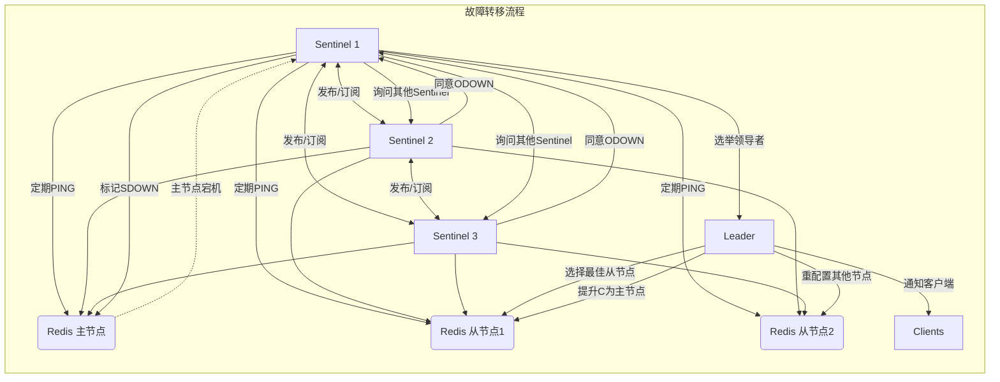
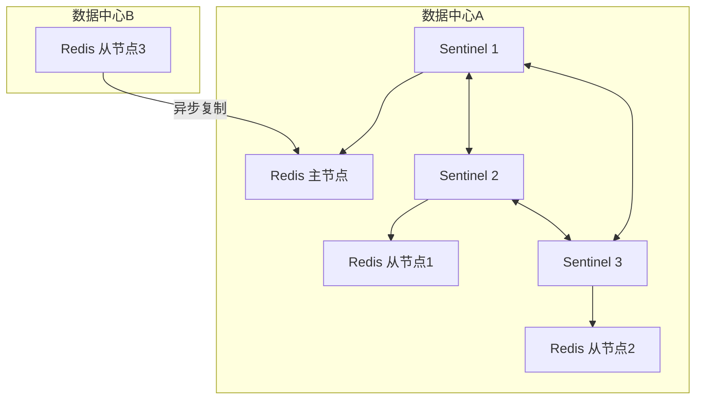

# Redis Sentinel：高可用性守护者详解

Redis Sentinel 是 Redis **官方提供的高可用性（HA）解决方案**，它不是一个替代 Redis 的系统，而是**监控和管理 Redis 主从架构的分布式系统**。当主节点发生故障时，Sentinel 能够自动执行故障转移，确保 Redis 服务持续可用。

## 🧩 什么是 Redis Sentinel？

Redis Sentinel 是一个**独立运行的进程集合**（通常部署 3-5 个实例），专门用于：
- 监控 Redis 主从实例
- 自动处理主节点故障
- 通知客户端拓扑变更
- 管理 Redis 配置

**核心特点**：
- 独立于 Redis 服务运行（单独的进程）
- 基于去中心化架构（多个 Sentinel 实例协同工作）
- 无需外部依赖（纯 Redis 生态解决方案）
- 轻量级（资源消耗小，通常 < 1% CPU）

## ⚙️ Redis Sentinel 的核心作用

### 1️⃣ **实时监控（Monitoring）**
- 持续检查所有被监控的 Redis 实例（主节点和从节点）是否正常响应
- 通过 `PING` 命令检测实例存活状态
- 监控复制延迟、连接数、内存使用等关键指标
- **检测机制**：主观下线（SDOWN）→ 客观下线（ODOWN）

### 2️⃣ **自动故障转移（Automatic Failover）**
这是 Sentinel **最核心的价值**：
1. 当多数 Sentinel 确认主节点"客观下线"后
2. 选举一个 Sentinel 作为**领导者**负责故障转移
3. 从从节点中选择**最适合**的节点提升为新主节点
4. 重新配置其他从节点，指向新主节点
5. 通知客户端新的主节点地址
6. **整个过程通常在 10-30 秒内完成**

### 3️⃣ **配置中心（Configuration Provider）**
- 客户端通过 Sentinel 获取当前主节点地址
- 故障转移后自动更新客户端连接信息
- 避免客户端硬编码主节点地址

### 4️⃣ **通知系统（Notification）**
- 可配置故障事件通知（邮件、Slack、Webhook 等）
- 提供 API 供监控系统集成
- 记录详细的故障转移日志

## 📊 Redis Sentinel 工作原理（关键流程）



## 🌐 典型使用场景

### ✅ 场景 1：关键业务系统高可用保障
- **典型行业**：金融交易系统、支付平台、用户认证服务
- **需求特点**：
    - 不能容忍长时间服务中断（RTO < 30秒）
    - 数据量适中（单节点可承载）
    - 已有主从架构
- **Sentinel 价值**：自动故障转移，避免人工干预导致的长时间停机

### ✅ 场景 2：缓存服务稳定性提升
- **典型应用**：电商网站商品缓存、社交平台会话存储
- **痛点解决**：
    - 主节点故障导致缓存击穿（大量请求直达数据库）
    - 人工切换主节点耗时长（5-10分钟）
- **Sentinel 价值**：30秒内自动恢复，保护后端数据库

### ✅ 场景 3：配置中心高可用
- **典型应用**：微服务配置管理（如 Spring Cloud Config）
- **特殊要求**：
    - 配置数据必须强一致
    - 服务中断导致所有微服务启动失败
- **Sentinel 价值**：确保配置服务持续可用，避免级联故障

### ✅ 场景 4：混合云/多数据中心部署
- **典型架构**：主数据中心 + 备用数据中心
- **Sentinel 配置**：
    - 跨数据中心部署 Sentinel 实例
    - 配置合适的 `down-after-milliseconds` 避免网络波动误判
- **价值**：实现跨地域高可用，应对区域性故障

## ⚠️ 不适用场景（需要 Redis Cluster）

| 场景 | Sentinel | Cluster |
|------|----------|---------|
| **数据分片需求** | ❌ 不支持 | ✅ 支持 |
| **超大数据集** (>25GB) | ❌ 单节点限制 | ✅ 分布式存储 |
| **超高写入吞吐** | ❌ 主节点单点瓶颈 | ✅ 写入分散 |
| **多写入点需求** | ❌ 仅单主节点 | ✅ 多主节点 |

**简单判断**：如果数据量小、不需要分片，但需要高可用 → 选 Sentinel；如果需要分片或超大容量 → 选 Cluster。

## 🛠️ 生产环境部署最佳实践

### 1. 部署架构（关键！）


- **Sentinel 实例数**：**至少 3 个**（奇数，避免脑裂）
- **部署位置**：跨物理机/可用区（避免单点故障）
- **与 Redis 关系**：**不要与 Redis 实例同机部署**（故障时可能同时失效）

### 2. 核心配置参数（sentinel.conf）
```conf
# 监控主节点（名称 mymaster，地址 port，法定人数 2）
sentinel monitor mymaster 192.168.1.100 6379 2

# 主节点失效判定时间（毫秒）
sentinel down-after-milliseconds mymaster 30000

# 故障转移超时（毫秒）
sentinel failover-timeout mymaster 180000

# 并行同步从节点数
sentinel parallel-syncs mymaster 1

# 通知脚本
sentinel notification-script mymaster /path/to/notify.sh

# 客户端重定向配置
sentinel client-reconfig-script mymaster /path/to/reconfig.sh
```

### 3. 生产环境 docker-compose 示例
```yaml
version: '3.8'
services:
  # Redis 主节点
  redis-master:
    image: redis:7.2-alpine
    container_name: redis-master
    command: redis-server --requirepass your_strong_password
    ports:
      - "6379:6379"
    volumes:
      - redis-master-:/data
    networks:
      - redis-ha-net

  # Redis 从节点
  redis-replica1:
    image: redis:7.2-alpine
    container_name: redis-replica1
    command: >
      redis-server
      --slaveof redis-master 6379
      --masterauth your_strong_password
      --requirepass your_strong_password
    depends_on:
      - redis-master
    networks:
      - redis-ha-net

  # Redis Sentinel 集群（3节点）
  sentinel1:
    image: redis:7.2-alpine
    container_name: sentinel1
    command: >
      redis-sentinel
      /etc/redis/sentinel.conf
      --sentinel
    volumes:
      - ./sentinel/sentinel1.conf:/etc/redis/sentinel.conf
    ports:
      - "26379:26379"
    depends_on:
      - redis-master
      - redis-replica1
    networks:
      - redis-ha-net

  sentinel2:
    # 与sentinel1相同配置，使用不同配置文件
    image: redis:7.2-alpine
    container_name: sentinel2
    command: >
      redis-sentinel
      /etc/redis/sentinel.conf
      --sentinel
    volumes:
      - ./sentinel/sentinel2.conf:/etc/redis/sentinel.conf
    ports:
      - "26380:26379"
    depends_on:
      - redis-master
      - redis-replica1
    networks:
      - redis-ha-net

  sentinel3:
    # 第三个sentinel实例
    image: redis:7.2-alpine
    container_name: sentinel3
    command: >
      redis-sentinel
      /etc/redis/sentinel.conf
      --sentinel
    volumes:
      - ./sentinel/sentinel3.conf:/etc/redis/sentinel.conf
    ports:
      - "26381:26379"
    depends_on:
      - redis-master
      - redis-replica1
    networks:
      - redis-ha-net

volumes:
  redis-master:
  redis-replica:

networks:
  redis-ha-net:
    driver: bridge
```

### 4. Sentinel 配置文件示例（sentinel1.conf）
```conf
port 26379
dir "/data"

# 监控主节点（法定人数=2）
sentinel monitor mymaster redis-master 6379 2

# 认证配置
sentinel auth-pass mymaster your_strong_password

# 故障检测参数
sentinel down-after-milliseconds mymaster 30000
sentinel failover-timeout mymaster 180000
sentinel parallel-syncs mymaster 1

# 保护模式
protected-mode no

# 日志配置
logfile "/var/log/redis/sentinel.log"
```

## 🔍 故障排查关键命令

```bash
# 连接到 Sentinel
redis-cli -p 26379

# 查看监控的主节点
SENTINEL MASTER mymaster

# 查看所有从节点
SENTINEL REPLICAS mymaster

# 查看其他Sentinel实例
SENTINEL SENTINELS mymaster

# 强制故障转移（测试用）
SENTINEL FAILOVER mymaster

# 查看当前领导者
SENTINEL GET-MASTER-ADDR-BY-NAME mymaster
```

## 📌 最佳实践总结

1. **部署数量**：**至少 3 个 Sentinel 实例**，跨物理机部署
2. **法定人数(quorum)**：设置为 `(sentinel_count / 2) + 1`（如 3 个 Sentinel 设为 2）
3. **超时配置**：
    - `down-after-milliseconds`：根据网络质量设置（通常 30-60 秒）
    - `failover-timeout`：至少是主节点故障检测时间的 3 倍
4. **客户端配置**：
    - 使用支持 Sentinel 的客户端库（如 Jedis, Lettuce）
    - 配置多个 Sentinel 地址（提高连接可靠性）
5. **监控告警**：
    - 监控 Sentinel 日志中的 `+switch-master` 事件
    - 设置对 `master_link_status` 的监控
6. **定期演练**：
    - 每季度执行一次计划内故障转移测试
    - 验证客户端重连机制是否正常工作

## 💡 Sentinel vs Redis Stack 高可用

如果你使用 Redis Stack（包含 RedisJSON、RediSearch 等模块），**Sentinel 同样适用**：
- Sentinel 监控的是底层 Redis 服务，与上层模块无关
- 所有 Redis 模块数据会随主从复制同步
- 故障转移后，新主节点自动提供完整模块功能

**注意**：对于 Redis Stack 的生产部署，推荐：
```
Redis Stack Server (主) → Redis Stack Server (从)
       ↑                      ↑
  Sentinel 1             Sentinel 2
       ↖__________ Sentinel 3 __________↗
```

## 结论

Redis Sentinel 是**中小型系统实现 Redis 高可用的首选方案**，它解决了主从架构中最关键的单点故障问题，而无需改变应用架构或引入复杂分片逻辑。当你的系统：
- 数据量在单节点可承载范围内（通常 < 25GB）
- 需要 RTO < 30 秒的高可用保障
- 已有或计划使用主从复制架构

那么 Redis Sentinel 就是你不可或缺的"守护者"。对于更大规模的系统，可以考虑 Redis Cluster 或 Sentinel 与 Cluster 的混合架构。