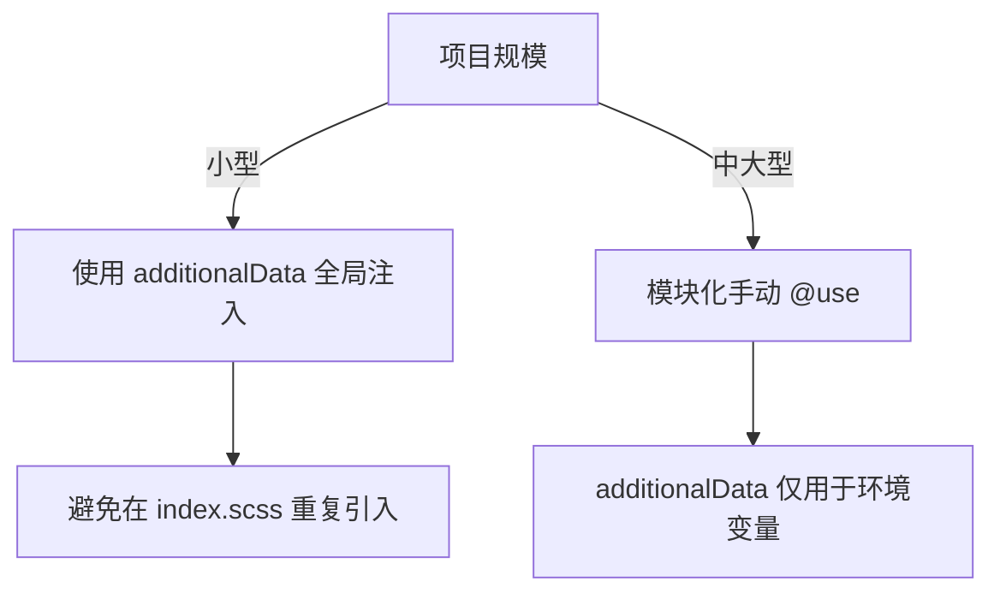

# 怎么在 index.scss 中合理组织全局样式文件

在项目中同时使用 **`index.scss` 的 `@use`** 和 **Vite 配置的 `additionalData`** 时，需要根据场景合理选择，避免重复或冲突。以下是详细分析和建议：

---

### **1. 两种配置的作用**
#### **(1) `index.scss` 中的 `@use`**
- **作用**：显式声明当前文件对 `variables.scss` 和 `mixins.scss` 的依赖。
- **特点**：
    - 模块化作用域，需手动在每个 SCSS 文件中按需引入。
    - 适合组件级样式文件（如 `component.module.scss`），避免全局污染。

#### **(2) Vite 的 `additionalData`**
- **作用**：全局注入 SCSS 代码到**所有样式文件**的头部（相当于自动在每个文件开头添加代码）。
- **特点**：
    - 避免在每个文件手动写 `@use`。
    - 适合全局共享的变量、Mixin（如主题色、工具函数）。

---

### **2. 是否需要同时配置？**
#### **✅ 推荐方案：二选一**
| 场景                     | 配置方式                     | 优点                          | 缺点                          |
|--------------------------|-----------------------------|-------------------------------|-------------------------------|
| **全局样式共享**         | 仅用 `additionalData`       | 减少重复代码，全项目自动生效  | 可能造成不必要的样式注入      |
| **模块化/组件化开发**    | 仅用 `index.scss` 的 `@use` | 作用域清晰，按需加载          | 每个文件需手动引入            |
| **混合使用（谨慎）**     | 两者同时配置                | 灵活性强                      | 需避免变量重复定义或冲突      |

#### **❌ 避免的问题**
- **重复引入**：  
  若同时在 `additionalData` 和 `index.scss` 中引入 `variables.scss`，会导致：
    - 变量/Mixin 被多次加载（可能引发 Sass 警告）。
    - 增加构建体积（虽然 Sass 会去重，但仍有开销）。

- **变量覆盖风险**：  
  `additionalData` 中的 `$injected-color` 可能被后续文件意外覆盖。

---

### **3. 具体实践建议**
#### **(1) 纯全局模式（推荐简单项目）**
**配置方式**：
- **仅使用 `additionalData`**，不在 `index.scss` 中写 `@use`。
- 适用于所有样式共享同一套变量/Mixin 的小型项目。

```javascript
// vite.config.ts
additionalData: `
  @use "@/styles/variables.scss" as *;
  @use "@/styles/mixins.scss" as *;
  $injected-color: ${process.env.NODE_ENV === 'production' ? 'green' : 'red'};
`,
```

#### **(2) 模块化模式（推荐大型项目）**
**配置方式**：
- **禁用 `additionalData` 中的 `@use`**，仅在 `index.scss` 或组件文件中手动引入。
- 适合需要明确作用域的中大型项目。

```javascript
// vite.config.ts
additionalData: `$injected-color: ${process.env.NODE_ENV === 'production' ? 'green' : 'red'};`, // 只注入必要的全局变量
```

```scss
// styles/main.scss
@use 'variables' as *;
@use 'mixins' as *;
```

#### **(3) 混合模式（需谨慎）**
**配置方式**：
- `additionalData` 仅注入**极少全局变量**（如环境变量）。
- `index.scss` 管理样式工具和布局。

```javascript
// vite.config.ts
additionalData: `$env-mode: ${process.env.NODE_ENV};`, // 仅注入环境相关变量
```

```scss
// styles/main.scss
@use 'variables' as *;
@use 'mixins' as *;

body {
  background-color: if($env-mode == 'production', $color-green, $color-red);
}
```

---

### **4. 决策流程图**


---

### **总结**
- **不要重复配置**：`variables/mixins` 的引入应在 `additionalData` 或 `index.scss` 中二选一。
- **推荐选择**：
    - 全剧变量：`additionalData`（简单项目）。
    - 模块化：手动 `@use`（大型项目）。
- **混合使用**：仅在需要动态注入环境变量时，且确保变量命名不冲突。


# index.scss 的 @use 'variables' as * 和 Vite 配置的 additionalData 的关系

在项目中同时使用 **`index.scss` 的 `@use`** 和 **Vite 配置的 `additionalData`** 时，需要根据场景合理选择，避免重复或冲突。以下是详细分析和建议：

---

### **1. 两种配置的作用**
#### **(1) `index.scss` 中的 `@use`**
- **作用**：显式声明当前文件对 `variables.scss` 和 `mixins.scss` 的依赖。
- **特点**：
    - 模块化作用域，需手动在每个 SCSS 文件中按需引入。
    - 适合组件级样式文件（如 `component.module.scss`），避免全局污染。

#### **(2) Vite 的 `additionalData`**
- **作用**：全局注入 SCSS 代码到**所有样式文件**的头部（相当于自动在每个文件开头添加代码）。
- **特点**：
    - 避免在每个文件手动写 `@use`。
    - 适合全局共享的变量、Mixin（如主题色、工具函数）。

---

### **2. 是否需要同时配置？**
#### **✅ 推荐方案：二选一**
| 场景                     | 配置方式                     | 优点                          | 缺点                          |
|--------------------------|-----------------------------|-------------------------------|-------------------------------|
| **全局样式共享**         | 仅用 `additionalData`       | 减少重复代码，全项目自动生效  | 可能造成不必要的样式注入      |
| **模块化/组件化开发**    | 仅用 `index.scss` 的 `@use` | 作用域清晰，按需加载          | 每个文件需手动引入            |
| **混合使用（谨慎）**     | 两者同时配置                | 灵活性强                      | 需避免变量重复定义或冲突      |

#### **❌ 避免的问题**
- **重复引入**：  
  若同时在 `additionalData` 和 `index.scss` 中引入 `variables.scss`，会导致：
    - 变量/Mixin 被多次加载（可能引发 Sass 警告）。
    - 增加构建体积（虽然 Sass 会去重，但仍有开销）。

- **变量覆盖风险**：  
  `additionalData` 中的 `$injected-color` 可能被后续文件意外覆盖。

---

### **3. 具体实践建议**
#### **(1) 纯全局模式（推荐简单项目）**
**配置方式**：
- **仅使用 `additionalData`**，不在 `index.scss` 中写 `@use`。
- 适用于所有样式共享同一套变量/Mixin 的小型项目。

```javascript
// vite.config.ts
additionalData: `
  @use "@/styles/variables.scss" as *;
  @use "@/styles/mixins.scss" as *;
  $injected-color: ${process.env.NODE_ENV === 'production' ? 'green' : 'red'};
`,
```

#### **(2) 模块化模式（推荐大型项目）**
**配置方式**：
- **禁用 `additionalData` 中的 `@use`**，仅在 `index.scss` 或组件文件中手动引入。
- 适合需要明确作用域的中大型项目。

```javascript
// vite.config.ts
additionalData: `$injected-color: ${process.env.NODE_ENV === 'production' ? 'green' : 'red'};`, // 只注入必要的全局变量
```

```scss
// styles/main.scss
@use 'variables' as *;
@use 'mixins' as *;
```

#### **(3) 混合模式（需谨慎）**
**配置方式**：
- `additionalData` 仅注入**极少全局变量**（如环境变量）。
- `index.scss` 管理样式工具和布局。

```javascript
// vite.config.ts
additionalData: `$env-mode: ${process.env.NODE_ENV};`, // 仅注入环境相关变量
```

```scss
// styles/main.scss
@use 'variables' as *;
@use 'mixins' as *;

body {
  background-color: if($env-mode == 'production', $color-green, $color-red);
}
```

---

### **4. 决策流程图**


---

### **总结**
- **不要重复配置**：`variables/mixins` 的引入应在 `additionalData` 或 `index.scss` 中二选一。
- **推荐选择**：
    - 全剧变量：`additionalData`（简单项目）。
    - 模块化：手动 `@use`（大型项目）。
- **混合使用**：仅在需要动态注入环境变量时，且确保变量命名不冲突。


# @mixin 的组织方式，是否统一、集中组织？

您提出了一个非常好的问题！关于 `@mixin` 的组织方式，确实存在不同的实践模式。以下是专业级的解决方案和最佳实践建议：

---

### **1. 核心原则：按功能边界划分**
#### **(1) 模块化设计（推荐方案）**
| 文件类型          | 职责范围                          | `@mixin` 示例                     | 存放位置              |
|-------------------|-----------------------------------|-----------------------------------|-----------------------|
| **功能型混入**    | 通用工具（与具体样式解耦）        | 间距工具、响应式断点              | `mixins.scss`         |
| **上下文型混入**  | 依赖特定上下文（主题/动画）       | 主题生成、动画效果                | 所属模块文件内        |

#### **(2) 您的示例场景处理**
```scss
// ✅ themes.scss 中保留主题相关的混入
@mixin generate-theme-vars($theme) { /* 专门处理主题变量生成 */ }

// ✅ animate.scss 中保留动画相关的混入
@mixin fade-in($duration) { /* 专属动画效果 */ }

// ✅ mixins.scss 中存放通用工具
@mixin flex-center { /* 通用布局工具 */ }
```

---

### **2. 为什么这样设计？**
#### **(1) 高内聚性**
- **主题混入** 需要直接访问 `$themes` Map 变量，放在 `themes.scss` 可避免循环依赖
- **动画混入** 需要关联 `$animation-durations` 等配置，集中管理更易维护

#### **(2) 低耦合性**
- 通用工具混入（如 `@mixin text-ellipsis`）应保持与业务解耦
- 组件级混入（如 `@mixin button-style`）应放在组件对应的 SCSS 模块

#### **(3) 编译优化**
Sass 的模块系统（`@use`）会按需加载依赖，分散混入不会增加冗余代码

---

### **3. 实际项目目录建议**
```markdown
styles/
├── core/
│   ├── _mixins.scss       # 通用工具混入（间距、响应式等）
│   ├── _functions.scss    # 工具函数
│   └── _utils.scss        # 原子类生成器
├── themes/
│   ├── _variables.scss    # 主题变量
│   ├── _generator.scss    # 主题混入（含@mixin）
│   └── _dark-mode.scss    # 暗黑模式逻辑
└── animations/
    ├── _entrance.scss     # 入场动画混入
    ├── _micro.scss        # 微交互混入
    └── _keyframes.scss    # 关键帧定义
```

---

### **4. 混入复用示例**
#### **(1) 通用混入（mixins.scss）**
```scss
/// 响应式断点工具
/// @param {string} $breakpoint - 断点名称
@mixin respond-to($breakpoint) {
  @media #{map-get($breakpoints, $breakpoint)} {
    @content;
  }
}
```

#### **(2) 主题混入（themes.scss）**
```scss
/// 生成CSS变量（依赖主题Map）
@mixin generate-theme-vars($theme) {
  :root {
    @each $key, $value in $theme {
      --#{$key}: #{$value};
    }
  }
}
```

#### **(3) 动画混入（animate.scss）**
```scss
/// 抛物线动画（依赖时间变量）
@mixin parabola($duration) {
  animation: parabola $duration map-get($easing-functions, 'bounce');

  @keyframes parabola {
    /* 关键帧定义 */
  }
}
```

---

### **5. 如何避免冲突？**
#### **(1) 命名空间控制**
```scss
// themes/_generator.scss
@mixin theme-vars { /* ... */ }

// 使用时显式指定模块
@use 'themes/generator' as theme;

.theme-wrapper {
  @include theme.theme-vars;
}
```

#### **(2) 私有化混入**
```scss
// 以下划线开头的混入不会暴露给外部
@mixin _internal-calculation { /* 仅限当前文件使用 */ }
```

---

### **6. 构建工具兼容性**
现代构建工具（Vite/Rollup）会优化 SCSS 编译：
- 通过 `@use` 按需加载
- 重复的混入定义会被跳过（基于文件哈希）

---

### **总结建议**
1. **小型项目**：可以保留在 `mixins.scss` 中统一管理
2. **中大型项目**：按功能拆分到对应模块，遵循以下规则：
  - 混入是否强依赖当前模块的变量/函数？
    - 是 → 放在当前模块
    - 否 → 提到 `core/mixins.scss`
3. **组件库开发**：为每个组件创建单独的混入文件（如 `_button-mixins.scss`）

这种架构既能保持代码组织清晰，又能实现最优的编译性能。